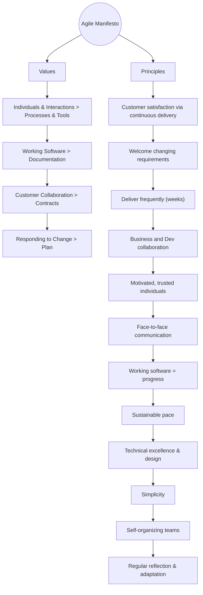

## ⚠️ Agile Manifesto - Critique & Reality Check

Over the years, many teams have unintentionally turned **Agile** into a set of rituals rather than a mindset.  
The **Agile Manifesto** was never meant to be prescriptive — it values *adaptation over compliance*.

### Common Pitfalls
- Treating Agile as a **methodology** instead of a **philosophy**.  
- Running ceremonies (stand-ups, retros, sprint planning) as **checkbox rituals** without purpose.  
- Prioritizing **process over people**, ironically contradicting the manifesto’s first value.  
- **Scaling frameworks** (Scrum, SAFe, LeSS) that add rigidity and bureaucracy instead of agility.   

### How to Stay True to Agile
- Use the manifesto as **guiding principles**, not strict rules.  
- Continuously ask: *“Is this ceremony helping us deliver value?”*  
- Focus on **outcomes, not outputs**: customer satisfaction, working software, adaptability.  
- Encourage **reflection and adaptation** instead of blind compliance.  

> Agile works best when treated as a **mindset of continuous learning and improvement** — not a checklist of rituals.

